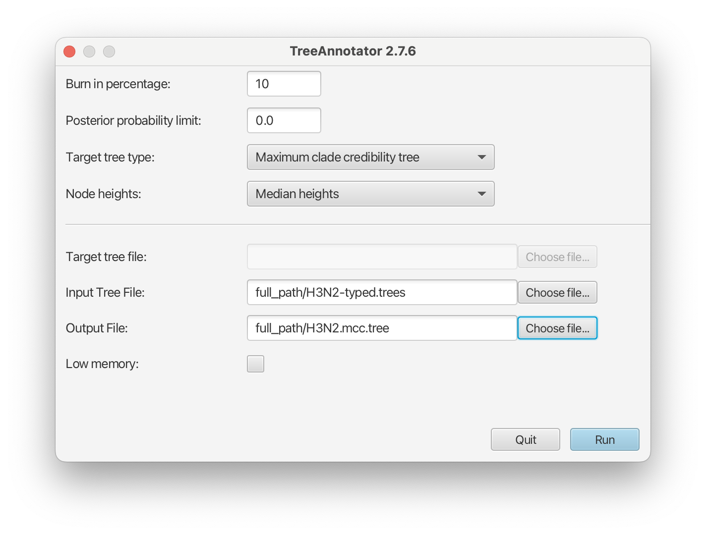
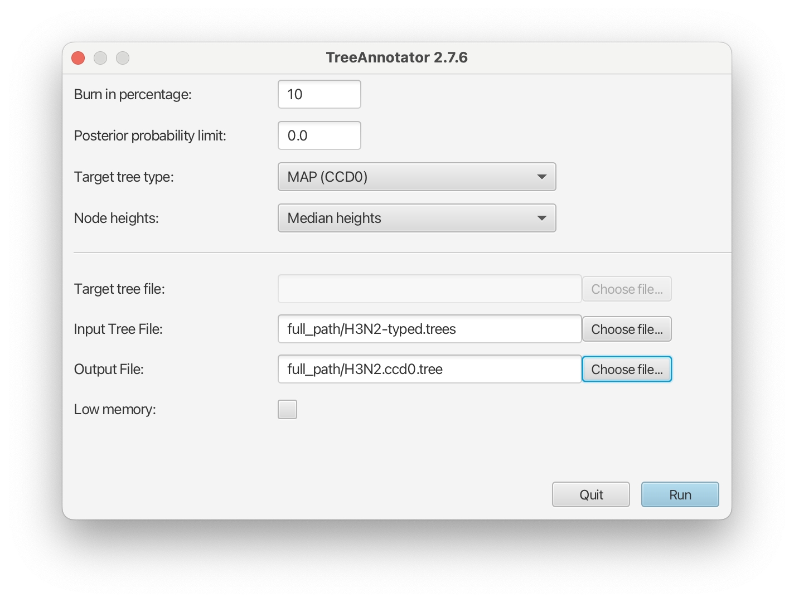
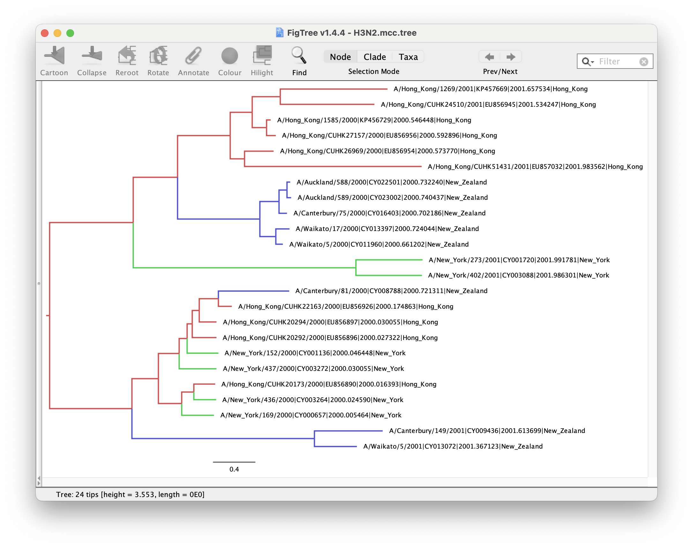
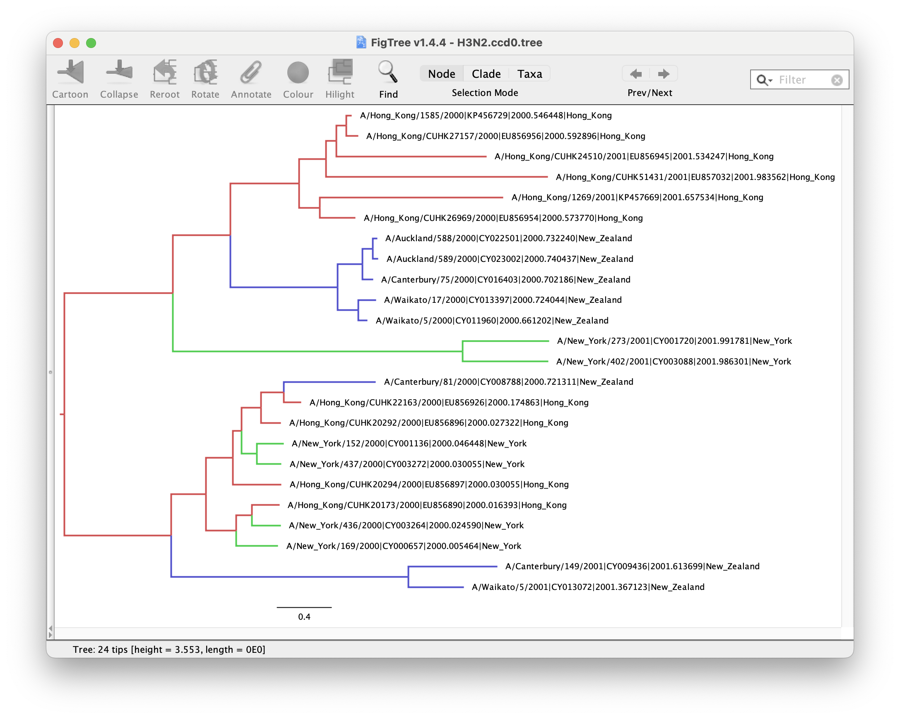

# Background

Phylogeographic methods can help reveal the movement of genes between populations of organisms. This has been widely used to quantify pathogen movement between different host populations, the migration history of humans, and the geographic spread of languages or the gene flow between species using the location or state of samples alongside sequence data. Phylogenies therefore offer insights into migration processes not available from classic epidemiological or occurrence data alone.

The structured coalescent allows to coherently model the migration and coalescent process, but struggles with complex datasets due to the need to infer ancestral migration histories. Thus, approximations to the structured coalescent, which integrate over all ancestral migration histories, have been developed. This tutorial gives an introduction into how a MASCOT analysis in BEAST2 can be set-up. MASCOT is short for **M**arginal **A**pproximation of the **S**tructured **CO**alescen **T**  and implements a structured coalescent approximation . This approximation doesn't require migration histories to be sampled using MCMC and therefore allows to analyse phylogenies with more than three or four states.

----

# Programs used in this Exercise

### BEAST2 - Bayesian Evolutionary Analysis Sampling Trees 2

BEAST2 ([http://www.beast2.org](http://www.beast2.org)) is a free software package for Bayesian evolutionary analysis of molecular sequences using MCMC and strictly oriented toward inference using rooted, time-measured phylogenetic trees. This tutorial is written for BEAST v{{ page.beastversion }} .

### BEAUti2 - Bayesian Evolutionary Analysis Utility

BEAUti2 is a graphical user interface tool for generating BEAST2 XML configuration files.

Both BEAST2 and BEAUti2 are Java programs, which means that the exact same code runs on all platforms. For us it simply means that the interface will be the same on all platforms. The screenshots used in this tutorial are taken on a Mac OS X computer; however, both programs will have the same layout and functionality on both Windows and Linux. BEAUti2 is provided as a part of the BEAST2 package so you do not need to install it separately.

### TreeAnnotator

TreeAnnotator is used to produce a summary tree from the posterior sample of trees using one of the available algorithms. It can also be used to summarise and visualise the posterior estimates of other tree parameters (e.g. node height).

TreeAnnotator is provided as a part of the BEAST2 package so you do not need to install it separately.

### Tracer

Tracer ([http://tree.bio.ed.ac.uk/software/tracer](http://tree.bio.ed.ac.uk/software/tracer)) is used to summarise the posterior estimates of the various parameters sampled by the Markov Chain. This program can be used for visual inspection and to assess convergence. It helps to quickly view median estimates and 95% highest posterior density intervals of the parameters, and calculates the effective sample sizes (ESS) of parameters. It can also be used to investigate potential parameter correlations. We will be using Tracer v{{ page.tracerversion }}.

### FigTree

FigTree ([http://tree.bio.ed.ac.uk/software/figtree](http://tree.bio.ed.ac.uk/software/figtree)) is a program for viewing trees and producing publication-quality figures. It can interpret the node-annotations created on the summary trees by TreeAnnotator, allowing the user to display node-based statistics (e.g. posterior probabilities). We will be using FigTree v{{ page.figtreeversion }}.

----

# Practical: Parameter and State inference using the approximate structured coalescent

In this tutorial, we will estimate migration rates, effective population sizes and locations of internal nodes using the marginal approximation of the structured coalescent implemented in BEAST2, MASCOT .

The aim is to:

-   Learn how to infer structure from trees with sampling location
-   Get to know how to choose the set-up of such an analysis
-   Learn how to read the output of a MASCOT analysis

## Setting up an analysis in BEAUti

### Download MASCOT

First, we have to download the package MASCOT using the BEAUTi package manager. Go to **File** >> **Manage Packages** and download the package MASCOT.

<figure>

 

<figcaption>Figure 1: Download the MASCOT package.</figcaption>

</figure>

MASCOT will only be available in BEAUti once you close and restart the program.

### Loading the Influenza A/H3N2 Sequences (Partitions)

The sequence alignment is in the file [H3N2.nexus](http://github.com/nicfel/Mascot-Tutorial/raw/master/data/H3N2.nexus). Right-click on this link and save it to a folder on your computer. Once downloaded, this file can either be drag-and-dropped into BEAUti or added by using BEAUti's menu system via **File** >> **Import Alignment**. Once the sequences are added, we need to specify the sampling dates.

### Get the sampling times (Tip Dates)

Open the _Tip Dates_ tab and then select the "Use tip dates" checkbox.

The sampling times are encoded in the sequence names. We can tell BEAUti to use these by clicking the **Auto-configure** button. The sampling times appear following the third vertical bar "\|" in the sequence name. To extract these times, select "split on character", enter "\|" (without the quotes) in the text box immediately to the right, and then select "3" from the drop-down box to the right, as shown in the figure below.

<figure>

 

<figcaption>Figure 2: Guess sampling times.</figcaption>

</figure>

Clicking "Ok" should now populate the table with the sample times extracted from the sequence names: the column **Date** should now have values between 2000 and 2002 and the column **Height** should have values from 0 to 2. The heights denote the time difference from a sequence to the most recently sampled sequence. If everything is specified correctly, the sequence with Height 0.0 should have Date 2001.9.

### Specify the Site Model (Site Model)

Next, we have to specify the site model. To do this, choose the _Site Model_ tab. For Influenza Hemagluttanin sequences as we have here, HKY is the most commonly used model of nucleotide evolution. This model allows for differences in transversion and transition rates, meaning that changes between bases that are chemically more closely related (transitions) are allowed to have a different rate to changes between bases that chemically more distinct (transversions).

Additionally, we should allow for different rate categories for different sites in the alignment. This can be done by setting the **"Gamma Category Count" to 4**, which is just a value that has typically been used. Make sure that estimate is checked next to the shape parameter. To reduce the number of parameters we have to estimate, we can set Frequencies to Empirical.

<figure>

 

<figcaption>Figure 4: Set the site model.</figcaption>

</figure>

### Set the clock model (Clock Model)

Now, we move to the _Clock Model_ tab. For rapidly evolving viruses, the assumption of a strict molecular clock is often made, meaning that the molecular clock is the same on each branch of the phylogeny. To reduce the burn-in phase, we can set the **initial value to 0.005**. Please note that this is **not** the prior on the clock rate (yet), but the **starting value** of the parameter in MCMC.

<figure>

 

<figcaption>Figure 5: Set the initial clock rate.</figcaption>

</figure>

### Get the sampling locations (Tip Locations)
Next, we switch to the _Priors_ tab.

We first have to choose the tree prior, which in this case is MASCOT. Search the drop down menu next to `Tree.t:H3N2` and choose MASCOT. By default, the rate dynamics is `Constant`, which means that effective population sizes and migration rates are assumed to be constant through time. We next have to define the sampling location of the individual tips.

Initially the column **Location** should be _NOT\_SET_ for every sequence. After clicking the **Guess** button, you can split the sequence on the vertical bar "\|" again by selecting "split on character" and entering "\|" in the box. However, the locations are in the fourth group, so this time choose "4" from the drop-down menu. After clicking the **OK** button, the window should look like the one shown in the figure below:

<figure>

 

<figcaption>Figure 3: Configuring sample locations.</figcaption>

</figure>

### Specify the priors (Priors)

Now, we need to set the priors for the various parameters of the model. Under the _Priors_ tab, you can find the parameter priors below the tree prior.

First, consider the **effective population size _Ne_**. Since we have only a few samples per location, meaning little information about the different effective population sizes, we will need an informative prior. In this case, we will use a log normal prior with parameters **M=0** and **S=1**. (These are respectively the **mean** and **variance** of the corresponding normal distribution in log space.) To use this prior, choose "Log Normal" from the drop down menu to the right of the `Ne.t:H3N2` parameter label, then click the arrow to the left of the same label and fill in the parameter values appropriately (i.e., **M=0** and **S=1**). Ensure that the "Mean In Real Space" checkbox remains unchecked.

The existing exponential distribution as a prior on the **migration rate** puts much weight on lower values while not prohibiting larger ones. For migration rates, a prior that prohibits too large values while not greatly distinguishing between very small and _very_ very small values is generally a good choice. However, be aware that the exponential distribution is quite an informative prior: one should be careful when choosing its mean so that feasible migration rates lie within the 95% interval of the prior distribution. (This can be determined by clicking the arrow to the left of the parameter name and looking at the values below the graph that appears on the right.) We keep the default **mean value of 1** for `migrationConstant`.

Finally, set the prior for the **clock rate**. We have a good idea about the clock rate of Influenza A/H3N2 Hemagglutinin. From previous work by other people, we know that the clock rate will be around 0.005 substitution per site per year. To include that prior knowledge, we can set the prior on the `clockRate` to a Log Normal distribution with **a mean of 0.005 in real space**. To specify the mean in real space, make sure that the box "Mean In Real Space" is checked. If we set the **S value to 0.25**, we expect the clock rate to be between 0.00321 and 0.00731 with 95% uncertainty.

<figure>

 

<figcaption>Figure 6: Set up of the prior distributions.</figcaption>

</figure>

We keep the default priors for the site model parameters `gammaShape` and `kappa`.

### Specify the MCMC chain length (MCMC)

Now switch to the _MCMC_ tab. Here we can set the length of the MCMC chain and decide how frequently the parameter and trees are logged. For this dataset, 2 million iterations should be sufficient. In order to have enough samples but not create too large files, we can set the logEvery to 2000, so we have 1001 samples overall. Do this for the tracelog and the treelog. Next, we have to save the `*.xml` file using **File** >> **Save as**.

<figure>

 

<figcaption>Figure 7: save the \*.xml.</figcaption>

</figure>

### Run the analysis using BEAST2

Run the `*.xml` using BEAST2 or use finished runs from the _precooked-runs_ folder. The analysis should take about 6 to 7 minutes.

If you want to learn some more about what the migration rates we actually estimate, have a look at this blog post of Peter Beerli [http://popgen.sc.fsu.edu/Migrate/Blog/Entries/2013/3/22_forward-backward_migration_rates.html](http://popgen.sc.fsu.edu/Migrate/Blog/Entries/2013/3/22_forward-backward_migration_rates.html).

### Analyse the log file using Tracer

First, we can open the `*.log` file in tracer to check if the MCMC has converged. The ESS value should be above 200 for almost all values and especially for the posterior estimates.

<figure>

 

<figcaption>Figure 8: Check if the posterior converged.</figcaption>

</figure>

We can have a look at the marginal posterior distributions for the effective population sizes. New York is inferred to have the largest effective population size before Hong Kong and New Zealand. This tells us that two lineages that are in New Zealand are expected to coalesce quicker than two lineages in Hong Kong or New York.

<figure>

 

<figcaption>Figure 9: Compare the different inferred effective population sizes.</figcaption>

</figure>

In this example, we have relatively little information about the effective population sizes of each location. This can lead to estimates that are greatly informed by the prior. Additionally, there can be great differences between median and mean estimates. The median estimates are generally more reliable since they are less influence by extreme values.

<figure>

 

<figcaption>Figure 10: Differences between mean and median estimates.</figcaption>

</figure>

We can then look at the inferred migration rates. The migration rates have the label b_migration.\*, meaning that they are **backwards-in-time** migration rates. The highest rates are from New York to Hong Kong. Because they are backwards-in-time migration rates, lineages from New York are inferred to be likely from Hong Kong if we're going backwards in time. In the inferred phylogenies, we should therefore make the observation that lineages ancestral to samples from New York are inferred to be from Hong Kong.

A more in depth explanation of what backwards migration really are can be found here [http://popgen.sc.fsu.edu/Migrate/Blog/Entries/2013/3/22_forward-backward_migration_rates.html](http://popgen.sc.fsu.edu/Migrate/Blog/Entries/2013/3/22_forward-backward_migration_rates.html)

<figure>

 

<figcaption>Figure 11: Compare the inferred migration rates.</figcaption>

</figure>

### Make the summary tree using TreeAnnotator

Next, we want to summarize the trees. This we can do using TreeAnnotator. Until recently the **_maximum clade credibility_ tree (MCC)** has been the default summary method in TreeAnotator. To produce MCC trees TreeAnotator takes the set of trees and find the best supported tree by maximising the product of the posterior clade probabilities. It will then annotate this representative summary tree with the mean ages of all the nodes and the corresponding 95% HPD ranges as well as the posterior clade probability for each node.

A new point estimate, called a **_conditional clade distribution_ tree (CCD)** has been proposed . It has been shown to outperform MCC in terms of accuracy (based on Robinson-Foulds distance to the true tree) and precision (how different the point estimates calculated for replicate MCMC chains are). CCD methods may produce a tree that would be well supported but has not been sampled during MCMC. This is beneficial for large trees and complex parameter regimes. Since both methods are still widely used, we show how to use them to summarise the posterior tree distribution. **To save time, you may run just one method and compare it to the other using the example below.**

#### Producing MCC tree

> Open **TreeAnnotator** and then set the options as in the [Figure 12](#fig:mcc) below. You have to specify the **Burnin percentage**, **Target tree type**, **Node heights**, **Input Tree File** and the **Output File**.
>
> Use the typed trees in the file `H3N2-typed.trees` as **Input Tree File**. Name output file `H3N2.mcc.tree`.
>
> After clicking **Run** the program should summarize the trees.

<figure>

 

<figcaption>Figure 12: Make the maximum clade credibility tree.</figcaption>

</figure>

#### Producing CCD0 tree

To produce CCD0 summary tree, you will first need to install the CCD package.
> Open BEAUTi
> 
> Select **File** >> **Manage packages**
> 
> Select **CCD** package in the list and select **Install/Upgrade**
> 
> Close BEAUTi

<figure>
	
	
	<figcaption>Figure 13: Install CCD package</figcaption>
</figure>
 

Now you can proceed to make CCD0 tree:

> Open **TreeAnnotator** and then set the options as in the [Figure 14](#fig:ccd0) below. You have to specify the **Burnin percentage**, the **Node heights**, **Input Tree File** and the **Output File**.
>
> Use the typed trees in the file `H3N2-typed.trees` as **Input Tree File**. Name output file `H3N2.ccd0.tree`.
>
> After clicking **Run** the program should summarize the trees.

<figure>

 

<figcaption>Figure 14: Make the conditional clade credibility tree.</figcaption>

</figure>

### Analyse and compare the MCC and CCD0 summary trees

In each logging step of the tree during the MCMC, MASCOT logs several different things. It logs the inferred probability of each node being in any possible location. In this example, these would be the inferred probabilities of being in Hong Kong, New York and New Zealand. Additonally, it logs the most likely location of each node.

> Open **FigTree** and load your chosen summary tree (`H3N2.mcc.tree or H3N2.ccd0.tree`).
>
> On the left hand menu, select **Appearance** \>\> **Colour by** and select **max**. This is the location that was inferred to be most often the most likely location of the node.
>
> Select **Trees** \>\> **Order nodes** \>\> **increasing**. The sorting step is only needed so we can compare trees better.
>
> You may optionally increase line weight (**Appearance** \>\> **Line weight**) and tip label font (**Tip Labels** \>\> **Font size**).

Figures [15](#fig:figtree.mcc) and [16](#fig:figtree.ccd0) show the MCC and CCD0 trees respectively. First analyse tree for the method you followed.

We can determine if lineages ancestral to samples from New York are actually inferred to be from Hong Kong, or the probability of the root being in any of the locations.

To get the actual inferred probabilities of each node being in any of the 3 locations, you can go to **Node Labels** >> **Display** an then choose Hong_Kong, New_York or New_Zealand. These are the actual inferred probabilities of the nodes being in any location.

It should however be mentioned that the inference of nodes being in a particular location makes some simplifying assumptions, such as that there are no other locations (i.e. apart from the sampled locations) where lineages could have been.

Another important thing to know is that currently, we assume rates to be constant. This means that we assume that the population size of the different locations does not change over time. We also make the same assumption about the migration rates through time.

<figure>

 

<figcaption>Figure 15: MCC tree, inferred node locations.</figcaption>

</figure>

<figure>

 

<figcaption>Figure 16: CCD0 tree, inferred node locations.</figcaption>

</figure>

> Now, compare the figures for MCC and CCD0 summary trees. Can you see some differences?
>
> One advantage of the CCD0 summary method is that it can evaluate tree topologies that were not sampled during the MCMC. This is why it usually performs better on high-entropy (uncertain, spread-out) tree posterior. Knowing this, what observations can you make about our sample?

### Errors that can occur (Work in progress)

One of the errors message that can occur regularly is the following: `too many iterations, return negative infinity` This occurs when the integration step size of the ODE's to compute the probability of observing a phylogenetic tree in MASCOT is becoming too small. This generally occurs if at least one migration rate is really large or at least one effective population size is really small (i.e. the coalescent rate is really high). This causes integration steps to be extremely small, which in turn would require a lot of time to compute the probability of a phylogenetic tree under MASCOT. Instead of doing that, this state is rejected by assigning its log probability the value negative infinity.

This error can have different origins and a likely incomplete list is the following:

-   The prior on **migration rates** puts too much weight on really **high** rates. 
	- To fix this, reconsider your prior on the migration rates. Particularly, check if the prior on the migration rates makes sense in comparison to the height of the tree. If, for example, the tree has a height of 1000 years, but the prior on the migration rate is exponential with mean 1, then the prior assumption is that between any two states, we expect approximately 1000 migration events.

-   The prior on the **effective population sizes** is too **low**.
	- This means that the prior on the coalescent rate (1 over the effective population size) is too high. This can occur when the prior on the effective population size was chosen to be 1/X. To fix, reconsider your prior on the effective population size.

-   There are substantial changes of effective population sizes and/or migration rates over time that are not modelled.
	- In that case, changes in the effective population sizes or migration rates have to be explained by population structure, which can again lead to some very low effective population sizes and very high migration rates. There is unfortunately not much that can be done here since MASCOT is not an appropriate model for the dataset.

-   There is strong sub-population structure within the populations we assgined.
	- In that case, reconsider if the individual populations used are reasonable.

----

# Useful Links

If you interested in the derivations of the marginal approximation of the structured coalescent, you can find them here . This paper also explains the mathematical differences to other methods such as the theory underlying BASTA. To get a better idea of how the states of internal nodes are calculated, have a look in this paper .

-   MASCOT source code: [https://github.com/nicfel/Mascot](https://github.com/nicfel/Mascot)
-   [Bayesian Evolutionary Analysis with BEAST 2](http://www.beast2.org/book.html) 
-   BEAST 2 website and documentation: [http://www.beast2.org/](http://www.beast2.org/)
-   Join the BEAST user discussion: [http://groups.google.com/group/beast-users](http://groups.google.com/group/beast-users)

----

# Relevant References


